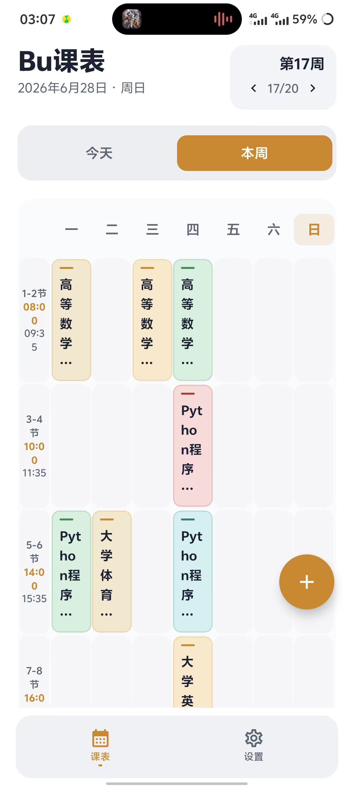
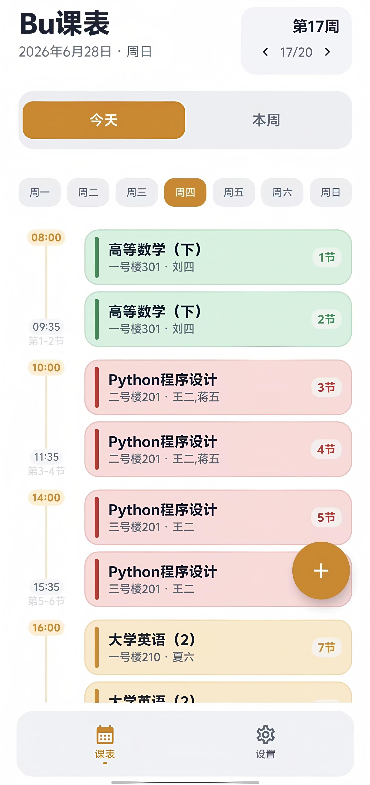

# Bu课表

Bu课表是一款面向大学生日常使用的 Android 课程表应用。第一版重点放在轻量、清晰、可维护：课程数据保存在本地，支持手动维护、学校教务导入，以及 AI 截图识别后的 CSV/文本导入。

## 功能亮点

- 周课表查看：按当前周展示课程，支持课程时间、地点、教师等信息。
- 手动维护课程：支持新增、编辑、删除课程。
- 教务导入：通过学校预设和教务网页脚本导入课表。
- AI 截图/CSV/文本导入：学校暂未适配时，可截图课表，让 AI 生成标准 CSV 或文本后导入。
- 导入预览确认：写入本地前先预览解析结果，确认无误后再导入。
- 桌面小组件：提供课程表小组件入口。

## 应用截图

<p>
  
  
</p>

## AI 截图/CSV 导入

如果学校教务系统暂未适配，可以使用“AI截图/CSV导入”：

1. 在教务系统或其他课表软件中截图。
2. 在 Bu课表中复制 AI 识别提示词。
3. 将截图和提示词发送给支持图片识别的 AI。
4. 复制 AI 返回的 CSV 或文本。
5. 回到 Bu课表粘贴内容，或选择 `.csv` / `.txt` 文件导入。
6. 预览无误后确认导入。

详细教程和可修改提示词见：

```text
docs/course-import-ai-csv-guide.md
```

## 技术栈

- Kotlin
- Jetpack Compose
- Material 3
- Room
- DataStore
- Hilt
- Navigation Compose
- Gradle / Android Gradle Plugin

## 项目结构

```text
app/src/main/java/com/bu/kebiao/
  data/          数据库、本地存储、适配器加载
  domain/        领域模型与仓库接口
  navigation/    页面导航
  ui/            Compose 页面与组件
  widget/        桌面小组件

app/src/main/assets/
  school_index.json       学校适配器索引
  adapters/               教务导入脚本资源

docs/
  course-import-ai-csv-guide.md  AI 截图/CSV 导入教程
  images/                        README 截图
```

## 说明

当前第一版以本地课程表管理和导入能力为核心。不同学校的教务系统差异较大，教务导入适配会持续迭代；AI 截图/CSV/文本导入用于补充暂未适配学校的使用场景。

后续版本计划继续优化课程提醒、小组件体验，并探索支持安卓厂商的灵动岛/实时活动类能力，让上课状态、下一节课等信息更自然地出现在系统级入口中。
